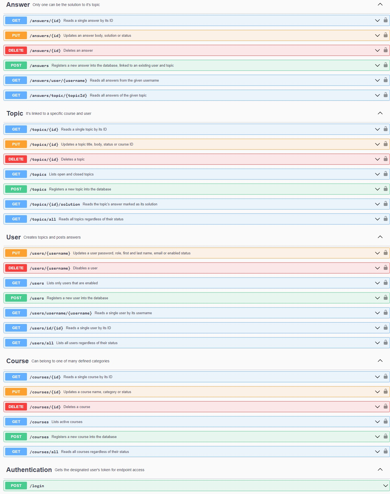

<h1 align="center">Alura Forum</h1>
<h2 align="center">register and queries for users, topics and answers</h2>

    
     
    
    

    

## Technologies used
* Java
* [Maven](https://maven.apache.org) - Dependency handler
* [Spring Initializer](https://start.spring.io)
* [Lombok](https://projectlombok.org) - Code automator
* [FlyWay](https://flywaydb.org) - Database versioning
* [MySQL](https://mysql.com) - Database
* [JWT Token](https://jwt.io) - Login authentication
* [OpenAPI](https://springdoc.org) - Spring documentation

## Introduction

This project is part of a course given by Alura and Oracle Next Education

This API allows communication between the front-end and the database. By means of diffeerent methods,
it is possible to create, read, update and delete (CRUD) users, topics, categories and answers. Each
user must access via his username and password, and use the token obtained to make the various request.

## API methods

## Main features
* Users
    * username and unique emails
    * roles: ADMIN, USER, VIEWER
* Topics
    * linked to the user who creates it and the category it belongs to
    * creation and update date record
    * status: OPEN, CLOSED, DELETED
    * when an answer is marked, the status change to CLOSED
* Anwers
    * linked to the user who creates it and the topic it belongs to
    * creation and update date record
    * only one answer could be mark as a solution

## Posible improves
* Every user has a role asigned, this roles should limit the access to different specific methods.
So, an ADMIN would have access to all methods, an USER would only could edit his own username, own topic, anwers and have
access to view others topic. And a VIEWER would have access to the consulting methods.

## Acknowledgments
🧡 <strong>Oracle</strong> 

💙 <strong>Alura Latam</strong> 

[def]: wagge